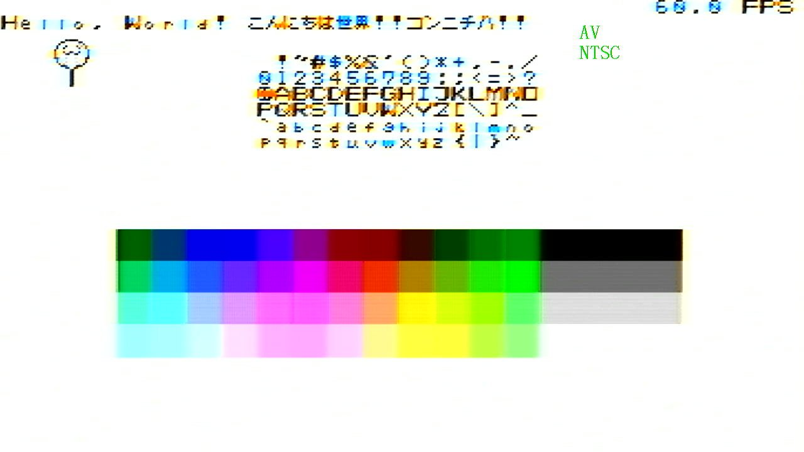

## pico 3.32bit NTSC
本リポジトリは、RP2040/2350 から、PIOと抵抗DACを用いてNTSCベースバンド信号を出力するプロジェクトです。
解像度360x232で、約50色のカラーグラフィックを表示できます。

## Gallery

*demo screen*

*monochrome mode demo*

## Required Resources
* 1 x PIO Block. 1 x sm.
* 2 DMA Channels
* DMA IRQ 0
* Framebuffers consume 168KB of RAM
* $\rm{clk\_sys} must be $157.5 [\rm{MHz}]$
* 4 consecutive GPIO pins

## About Resistor DAC
* 750Ω to GP16
* 1500Ω (= 2 series of 750Ω) to GP17
* 750Ω to GP18
* 375Ω (= 2 parallels of 750Ω) to GP19

then tie all of them up and connect to the hot pin

## Difference Between precise NTSC standard
* $f_{sc} = 3579545.\dot4\dot5 [\rm{Hz}]$
  * $\rm{clk\_sys} = 157.5 [\rm{MHz}] $ . $f_{sc} = \rm{clk\_sys} / 44$
* $f_H = f_{sc} / 228 \approx 1569.976 [\rm{KHz}] $
* $f_v = f_H / 262 \approx 59.923 [\rm{Hz}]$
* Signal levels
  * $-40\rm{IRE} = 0 [\rm{V}]$
